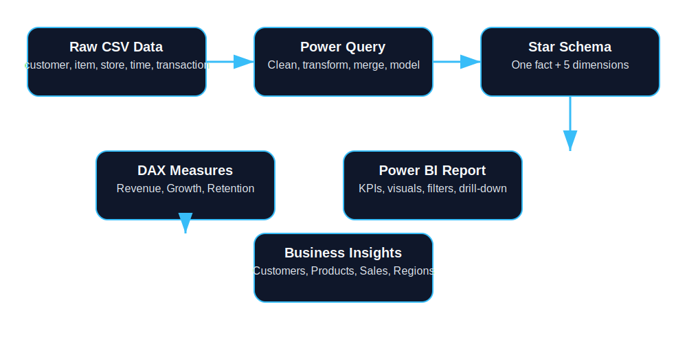
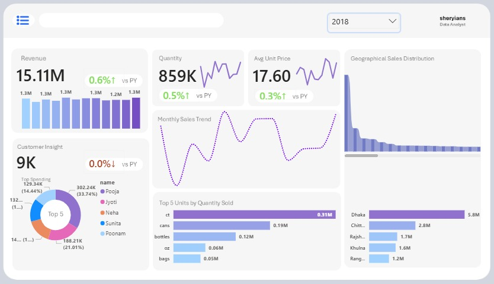
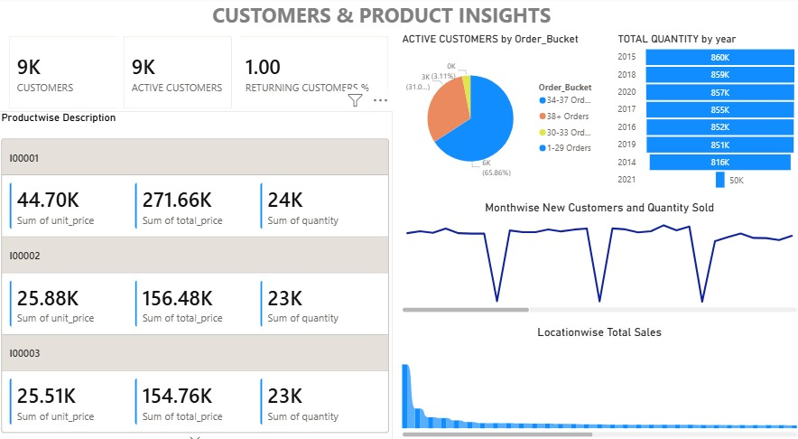

# 🛒 Retail Sales Analytics Dashboard | Power BI

## 📌 Project Overview

The Retail Sales Analytics Dashboard is an end-to-end Business Intelligence solution built using Power BI to analyze customer behavior, product performance, sales trends, and geographical distribution of revenue.

The project transforms raw transactional data into meaningful business insights through interactive visualizations, KPI tracking, and advanced DAX calculations. The dashboard enables stakeholders to monitor business performance, identify growth opportunities, and make data-driven decisions.

---

## 🎯 Business Problem

Retail businesses generate large volumes of transactional data daily. However, extracting meaningful insights from this data can be challenging without proper visualization and analysis.

This project aims to answer critical business questions:

- How much revenue has been generated?
- Who are the most valuable customers?
- Which products perform best?
- What locations generate the highest sales?
- How does customer activity change over time?
- What are the sales trends across months and years?
- How effective is customer retention?

---

# 📂 Dataset Overview

The project follows a **Star Schema Data Model** consisting of one Fact Table and multiple Dimension Tables.

## Fact Table

### Fact_Sales

Contains all sales transactions.

| Column |
|----------|
| payment_key |
| customer_key |
| time_key |
| item_key |
| store_key |
| quantity |
| unit |
| unit_price |
| total_price |

---

## Dimension Tables

### Customer Dimension

| Column |
|----------|
| customer_key |
| name |
| contact_no |
| nid |

Total Customers: **9K+**

---

### Item Dimension

| Column |
|----------|
| item_key |
| item_name |
| description |
| unit_price |
| manufacturing_country |
| supplier |
| unit |

Total Products: **264**

---

### Store Dimension

| Column |
|----------|
| store_key |
| division |
| district |
| upazila |

Total Stores: **726**

---

### Time Dimension

| Column |
|----------|
| time_key |
| date |
| day |
| week |
| month |
| quarter |
| year |

---

### Transaction Dimension

| Column |
|----------|
| payment_key |
| transaction_type |
| bank_name |

Total Payment Types: **39**

---

# 🏗 Data Modeling

A Star Schema model was implemented to optimize performance and simplify analytical reporting.

### Relationships

- Customer Dimension → Fact Sales
- Item Dimension → Fact Sales
- Store Dimension → Fact Sales
- Time Dimension → Fact Sales
- Transaction Dimension → Fact Sales

Relationship Type:

- One-to-Many
- Single Direction Filtering

---

# 🧭 Workflow Overview



This workflow shows the end-to-end process from raw CSV ingestion through Power Query transformation, star schema modeling, DAX calculation, and dashboard delivery.

---

# 📊 Dashboard 1 – Monthly Sales Analysis


## KPIs

### Revenue

```DAX
Revenue =
SUM(fact_table[total_price])
```

### Quantity Sold

```DAX
Quantity Sold =
SUM(fact_table[quantity])
```

### Average Unit Price

```DAX
Average Unit Price =
AVERAGE(fact_table[unit_price])
```

### Previous Year Revenue

```DAX
Revenue PY =
CALCULATE(
    [Revenue],
    SAMEPERIODLASTYEAR(time_dim[date])
)
```

### Revenue Growth %

```DAX
Revenue Growth % =
DIVIDE(
    [Revenue] - [Revenue PY],
    [Revenue PY]
)
```

---

## Visual Analysis

### Revenue Overview

Displays:

- Total Revenue
- Revenue Trend
- Year-over-Year Comparison

### Monthly Sales Trend

Tracks sales fluctuations over time.

Business Value:

- Identify seasonality patterns.
- Monitor business growth trends.

### Customer Insights

Displays top spending customers.

Business Value:

- Identify high-value customers.
- Support customer retention strategies.

### Geographical Sales Distribution

Analyzes revenue contribution by region.

Business Value:

- Determine strongest markets.
- Optimize regional planning.

### Top 5 Units by Quantity Sold

Examples:

- ct
- cans
- bottles
- oz
- bags

Business Value:

- Identify most demanded product packaging types.

### Top Revenue Locations

Examples:

- Dhaka
- Chittagong
- Rajshahi
- Khulna
- Rangpur

Business Value:

- Discover high-performing sales regions.

---

# 📊 Dashboard 2 – Customers & Product Insights


## KPIs

### Total Customers

```DAX
Total Customers =
DISTINCTCOUNT(customer_dim[customer_key])
```

### Active Customers

```DAX
Active Customers =
DISTINCTCOUNT(fact_table[customer_key])
```

### Returning Customer Percentage

```DAX
Returning Customer % =
DIVIDE(
    [Returning Customers],
    [Total Customers]
)
```

---

## Visual Analysis

### Customer Metrics

- Total Customers: 9K+
- Active Customers: 9K+
- Returning Customer Rate Tracking

### Product-wise Performance

Measures:

- Total Revenue
- Quantity Sold
- Product Value

Purpose:

- Identify top-performing products
- Compare product sales contribution

### Customer Order Bucket Analysis

Customer Segmentation:

- 1–29 Orders
- 30–33 Orders
- 34–37 Orders
- 38+ Orders

Business Value:

- Understand customer purchasing frequency
- Identify loyal customers

### Total Quantity by Year

Analyzes yearly product demand.

Insight:

- 2018 recorded the highest quantity sold.

### Monthly New Customer Trend

Tracks customer acquisition trends.

Business Value:

- Monitor growth and retention patterns.

### Location-wise Total Sales

Ranks locations based on sales performance.

Business Value:

- Identify high-performing markets.
- Support regional business strategies.

---

# 📈 Key Insights Generated

## Customer Insights

✔ More than 9K active customers.

✔ Strong customer engagement across years.

✔ Significant proportion of repeat customers.

✔ Consistent customer acquisition trend.

---

## Product Insights

✔ Top products contribute a major share of revenue.

✔ Product demand remains stable across years.

✔ Quantity sold helps identify high-demand products.

---

## Sales Insights

✔ Revenue exceeds 15 Million.

✔ More than 850K units sold.

✔ Positive Year-over-Year growth.

✔ Seasonal sales fluctuations identified.

---

## Geographical Insights

✔ Revenue is concentrated in a few key locations.

✔ Dhaka contributes the highest sales volume.

✔ Regional analysis supports market expansion decisions.

---

# 🛠 Power BI Features Used

- Power Query
- Data Cleaning
- Data Transformation
- Star Schema Modeling
- DAX Measures
- Time Intelligence Functions
- KPI Cards
- Pie Charts
- Bar Charts
- Line Charts
- Interactive Filters
- Drill-Down Analysis

---

# 📚 Skills Demonstrated

### Data Analytics

- Data Cleaning
- Data Transformation
- Exploratory Data Analysis
- Business Analysis

### Power BI

- Data Modeling
- Star Schema Design
- DAX Calculations
- KPI Development
- Dashboard Design
- Report Development

### Business Intelligence

- Customer Analytics
- Product Analytics
- Sales Analytics
- Geographic Analytics
- Trend Analysis
- Performance Monitoring

---

# 🧭 Workflow Overview


This workflow shows the end-to-end process from raw CSV ingestion through Power Query transformation, star schema modeling, DAX calculation, and dashboard delivery.

---

# 📺 Dashboard Gallery

### 1. Monthly Sales Analysis



### 2. Customers & Product Insights



---

# 🚀 Project Outcome

This Power BI solution successfully transformed retail transaction data into actionable business insights. The dashboard enables stakeholders to monitor sales performance, customer behavior, product demand, and regional growth through a centralized and interactive reporting platform.

The project demonstrates strong capabilities in Power BI, data modeling, DAX, business intelligence, and analytics while delivering practical value for retail decision-making.
